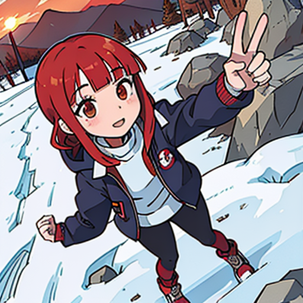

# ImagePromptGenerator

This project provides a way to generate image prompts based on given scenarios and situations, particularly designed for platforms like Instagram. The main workflow of the program involves two stages: initially generating a scene based on a character and situation and then refining that scene to produce a final result.

InstagramやGoogleを検索することで、他人のSNS投稿やネットの情報を参考にプロンプトを生成することができます。

## 使用例

**与えるCharacter**: ```日本人の女子大学生、赤毛の長髪、ぱっつん髪で垂れ目、幼い顔立ちで背は低い。```

**与えるSituation**: ```登山に行った```

**出力されるシーン**: 
```登山をテーマにしたこの写真では、彼女の特徴である赤毛の長髪、ぱっつん髪、垂れ目、幼い顔立ちを強調するために、まず彼女が山頂に立っている様子をキャプチャします。背景には登った山の壮大な風景を入れ、自然との一体感を強調します。彼女の顔と髪の特徴を際立たせるために、カメラは彼女の顔をアップで捉え、頭上からやや斜めに撮影します。このアングルは彼女の小柄な体型と幼い顔立ちを強調し、また彼女が山頂に立っていることを強調します。彼女は登山服を着ており、頭にはキャップをかぶり、手にはトレッキングポールを持っています。これにより彼女がアクティブなライフスタイルを送っていることを示します。また、彼女の笑顔と明るい表情は、登山が彼女にとって楽しい経験であることを伝えます。投稿には、彼女が登った山の名前や登山に関連するハッシュタグを含めます。```

**出力されるプロンプト**: ```(Japanese female college student:1.5), short stature, from above, long red hair, blunt bangs, drooping eyes, holding, arms at side, leg up, down jacket, ski jacket, leggings, hiking boots, fleece jacket, turtleneck, sunglasses, baseball cap, mountain, sky, cloudy weather, rocky terrain, snowfall.```

**生成される画像**:  

*selfie, (Japanese female college student:1.3), short stature, from above, long red hair, blunt bangs, drooping eyes, holding, arms at side, leg up, down jacket, ski jacket, leggings, hiking boots, fleece jacket, turtleneck, sunglasses, baseball cap, mountain, sky, cloudy weather, rocky terrain, snowfall.
Negative prompt: EasyNegative, paintings, sketches, (worst quality:2), (low quality:2), (normal quality:2), lowres, ((monochrome)), ((grayscale)), skin spots, acnes, age spots, extra fingers, fewer fingers, strange fingers, bad hand, ((((bad anatomy)))), bad hands, text, error, missing fingers, extra digit, fewer digits, cropped, jpeg artifacts, signature, watermark, username, sunburn, ((simple background)), hermaphrodite, long neck, mutated hands, poorly drawn hands, poorly drawn face, mutation, deformed, bad proportions, malformed limbs, extra limbs, cloned face, disfigured, gross proportions, (((missing arms))), (((missing legs))), (((extra arms))), (((extra legs))), (((extra breasts))), (((extra nipples))), plump, bad legs, error legs, bad feet, kid face,(identical twins),((misaligned nails)),((misaligned fingers)),((wrinkled knees )),(uneven skin tone), ((head wear)),((bruised knee))
Steps: 20, Sampler: DPM++ 2M Karras, CFG scale: 7, Seed: 3108895542, Size: 512x512, Model hash: b2c93e7a89, Model: flat2DAnimerge_v3_0, Version: v1.6.0 (強度の最大値を1.3、先頭に"selfie"を追加)*

## エージェントベースのプロンプト生成システムの解説

このプログラムは、特定の人物とシチュエーションを基に、Stable diffusionのような画像生成AI向けのプロンプトを生成するためのツールキットを提供します。主な仕組みは、エージェントベースのアプローチを採用し、2つのエージェントが役割を担当しています。

### 1つ目のエージェント: シーンの説明と構築
このエージェントは、与えられた人物や状況をもとに、インスタグラムのようなSNSに投稿する写真のシーンを具体的に想像・構築します。

### 2つ目のエージェント: プロンプトの生成
1つ目のエージェントの結果を基に、Stable diffusionのような画像生成AIに適切なプロンプト（呪文とも呼ばれる）を生成します。

これらのエージェントは、さまざまな「ツール」を活用してタスクを達成します。これらのツールは外部APIや内部関数として実装され、エージェントが自動的にアクセス・利用することで、より賢明な決定を下すことができます。

### 主要なツールの一覧と役割:

- SerpAPI: 現在のイベントや情報に関する質問に答えるためのツール。
- Instagram Search: ApifyClientを使用して、特定のタグに基づくインスタグラムの投稿を取得します。これにより、エージェントは人々がどのような内容を投稿しているかのアイディアを得ることができます。
- Organize Tool: 複数の情報やデータポイントを組み合わせ、適切なプロンプトや情報の組み合わせを生成するツールです。
- Various Setting AI Tools: 人物や状況に適切な情報（服装、背景、姿勢など）を提供するためのAI。それぞれの設定ファイルからプロンプトテンプレートを読み込み、それを基に情報を生成します。

External API Descriptions

- **ApifyClient**: This is used in conjunction with the Instagram scraper, allowing us to fetch top posts from Instagram based on a hashtag. It helps in gauging what kind of content is trending or popular for a given tag.
- **SerpAPIWrapper**: Useful for answering questions about current events, trends, or anything that's recent and might not be part of the pre-existing knowledge of the AI.


## Prerequisites

- Python 3.x

## Setup

1. Clone the repository:
```bash
git clone [repository_link_here]
cd [repository_directory_name]
```

2. Install the required packages:
```bash
pip install -r requirements.txt
```

3. name the .env.example file to .env:
```bash
mv .env.example .env
```

## Usage

1. To use the program, simply run the main.py script:
```bash
python main.py
```

2. You can modify the character and situation variables in main.py to generate prompts for different scenarios.

## まとめ:
このプログラムは、2つのエージェントと複数のツールを組み合わせて、特定の人物や状況に基づいた画像生成AI向けのプロンプトを効果的に生成することを目指しています。外部APIや内部関数を駆使して、エージェントが自動的に情報を収集・整理し、最終的なプロンプトを提供することが可能です。